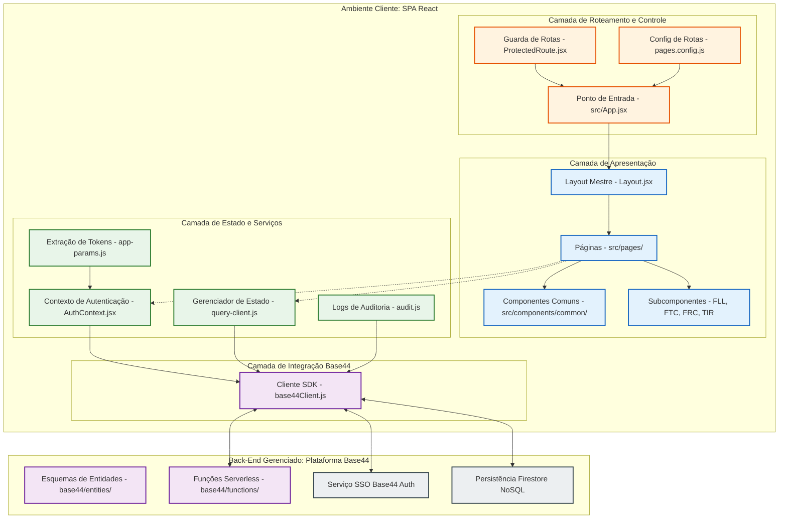
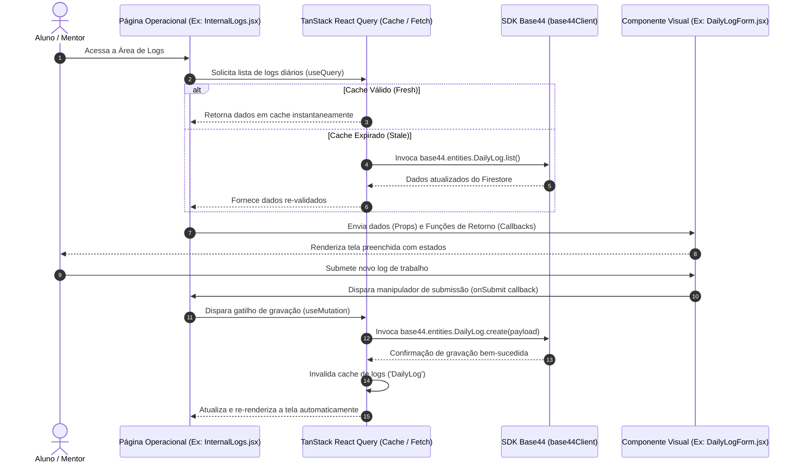
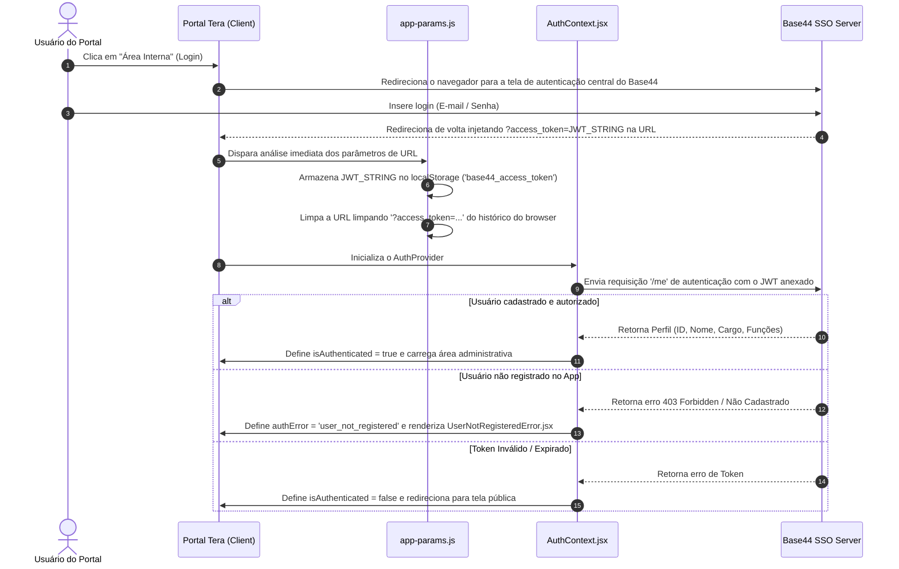
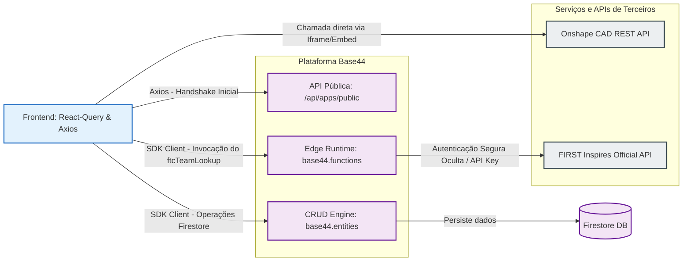
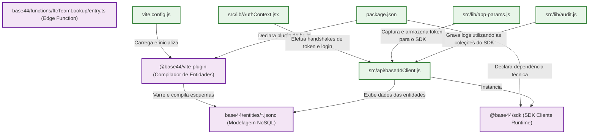
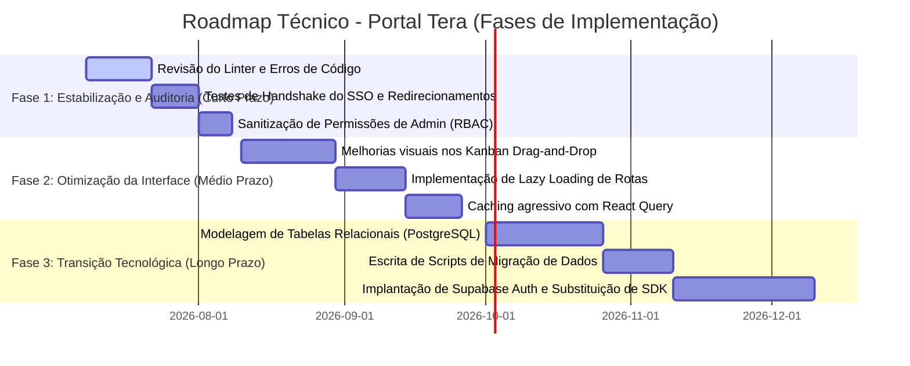

# Blueprint Arquitetural e Diagramas Técnicos (SYSTEM_BLUEPRINT.md)

Este documento apresenta o detalhamento de engenharia de software e os diagramas de arquitetura do **Portal Tera**. Ele serve como um mapa visual e conceitual para desenvolvedores, arquitetos e engenheiros de sistema que desejam compreender a fundo o ecossistema, os fluxos de dados, a modelagem de dados e as dependências da aplicação.

Os diagramas utilizam a notação **Mermaid**, amplamente integrada a visualizadores de repositórios como o GitHub.

---

## 📂 Índice de Diagramas e Mapas

1. [Diagrama de Módulos](#1-diagrama-de-módulos-arquitetura-em-camadas)
2. [Diagrama Páginas ➔ Componentes (Comunicação)](#2-diagrama-páginas--componentes-comunicação)
3. [Diagrama de Entidades do Banco de Dados](#3-diagrama-de-entidades-do-banco-de-dados)
4. [Diagrama do Fluxo de Autenticação SSO](#4-diagrama-do-fluxo-de-autenticação-sso)
5. [Diagrama de Integração de APIs e Chamadas de Dados](#5-diagrama-de-integração-de-apis-e-chamadas-de-dados)
6. [Fluxograma Completo de Navegação (Sitemap e Guardas)](#6-fluxograma-completo-de-navegação-sitemap-e-guardas)
7. [Diagrama de Dependências do Ecossistema Base44](#7-diagrama-de-dependências-do-ecossistema-base44)
8. [Mapa de Migração Tecnológica para Supabase](#8-mapa-de-migração-tecnológica-para-supabase)
9. [Roadmap Técnico Priorizado](#9-roadmap-técnico-priorizado)

---

## 1. Diagrama de Módulos (Arquitetura em Camadas)

Este diagrama representa a divisão de responsabilidades da aplicação, partindo do navegador do usuário até o back-end gerenciado do Base44.



---

## 2. Diagrama Páginas ➔ Componentes (Comunicação)

As páginas atuam como **Controllers de Visão**, controlando o estado compartilhado, iniciando mutações via React Query e passando dados brutos e manipuladores de eventos para os componentes secundários estruturados como componentes de apresentação pura (Dumb Components).



---

## 3. Diagrama de Entidades do Banco de Dados

Representação esquemática das **21 entidades** declaradas em formato JSON Schema na pasta `base44/entities/`. As entidades estão divididas por subsistemas funcionais da equipe:

```mermaid
erDiagram
    %% Subsistema de Auditoria e Logs Gerais
    AuditLog {
        string user_id
        string user_name
        string user_email
        string action_type
        string description
        string entity_name
        string user_agent
    }

    DailyLog {
        string user_id
        string user_name
        date date
        float hours_spent
        string completed_tasks
        string impediments
        string next_steps
        string category
    }

    MeetingNote {
        string title
        date date
        string_array attendees
        string summary
        string_array action_items
        string category
    }

    InternalProject {
        string name
        string description
        string lead_id
        string lead_name
        date deadline
        string status
        integer progress_percentage
    }

    Priority {
        string title
        string description
        string status
        string category
        date due_date
    }

    ProjectRisk {
        string title
        string probability
        string impact
        string mitigation_strategy
        string status
    }

    PrototypeTest {
        string mechanism_name
        string test_objective
        string results
        float success_rate
        string improvements_needed
        date date
    }

    OnshapeConfig {
        string document_id
        string workspace_id
        string element_id
        string category
        string label
        boolean is_active
    }

    %% Subsistema FLL
    FLLMember {
        string name
        string role
        string avatar_url
        integer years_active
    }

    FLLMission {
        string mission_number
        string title
        string description
        integer max_score
        boolean completed
        integer points_scored
        string rules
    }

    FLLTask {
        string title
        string description
        string status
        string priority
        string assignee_id
    }

    FLLAttachment {
        string name
        string description
        string onshape_url
        string image_url
        string created_by
        string status
    }

    FLLCoreValues {
        string title
        string description
        string_array members_involved
        date date
        integer score
    }

    FLLInnovationProject {
        string title
        string problem_statement
        string solution_details
        string_array tasks
        string feedback
        string status
    }

    FLLJudgePrep {
        string area
        string question
        string_array bullet_points_answer
        string_array assigned_members
    }

    %% Subsistema TIR (Torneio Interno)
    TIREquipe {
        string team_name
        string captain_name
        string_array members_list
        string category
        integer points
        string status
    }

    TIRFoto {
        string image_url
        string caption
        string team_id
        string uploaded_by
        integer likes_count
    }

    TIRMensagem {
        string sender_name
        string content
        timestamp timestamp
        boolean is_announcement
    }

    TIRRegra {
        string rule_title
        string description
        integer penalty_points
        string category
    }

    %% Relações e Pertencimento Lógico (NoSQL)
    DailyLog }o--|| AuditLog : "Gera rastros de escrita"
    InternalProject ||--o{ Priority : "Alinha prioridades semanais"
    FLLMember ||--o{ FLLTask : "Atribuído a tarefas"
    TIREquipe ||--o{ TIRFoto : "Contém mídias associadas"
    TIREquipe ||--o{ TIRMensagem : "Gera mural interativo"
```



---

## 4. Diagrama do Fluxo de Autenticação SSO

Este diagrama descreve a jornada completa de login do usuário, a captura do token na query de URL, a persistência segura no cliente e a validação RBAC (Role-Based Access Control):



---

## 5. Diagrama de Integração de APIs e Chamadas de Dados

O Portal se comunica com diferentes origens de dados. O diagrama a seguir mapeia como as requisições fluem para a API Base44 pública, entidades de banco de dados, funções serverless no lado do servidor e APIs externas seguras:



---

## 6. Fluxograma Completo de Navegação (Sitemap e Guardas)

Abaixo está o mapa completo de rotas navegáveis estruturado para demonstrar visualmente quais caminhos são abertos livremente ao público geral e quais necessitam da validação de acesso da Área Interna:

```mermaid
graph TD
    classDef public fill:#e8f5e9,stroke:#2e7d32,stroke-width:2px;
    classDef auth fill:#ffe0b2,stroke:#f57c00,stroke-width:2px;
    classDef private fill:#e3f2fd,stroke:#1565c0,stroke-width:2px;
    classDef limit fill:#ffebee,stroke:#c62828,stroke-width:2px;

    %% Rotas Públicas
    Home[/Página Inicial - /]:::public
    About[/Quem Somos - /about]:::public
    Team[/Membros - /team]:::public
    Sponsors[/Apoiadores - /sponsors]:::public
    Contact[/Contatos - /contact]:::public
    CurrentRobot[/Ficha Técnica Robô - /current-robot]:::public
    Engineering[/Logs de Engenharia - /engineering]:::public
    Gallery[/Galeria de Fotos - /gallery]:::public
    Competitions[/Programas - /competitions]:::public
    FLLScorer[/Calculadora FLL - /fll-scorer]:::public
    Shop[/Loja - /shop]:::public
    Memoria[/Linha do Tempo - /memoria]:::public
    TIR2026[/Torneio Interno - /tir2026]:::public

    %% Gatilho de Autenticação
    LoginGate{Autenticação Ativa?}:::auth

    %% Área Interna Protegida
    Dashboard[Dashboard Geral - /interna]:::private
    DailyLogs[Meus Logs Diários - /interna/daily-logs]:::private
    Meetings[Notas de Reunião - /interna/meetings]:::private
    Prototypes[Testes de Protótipo - /interna/prototypes]:::private
    Risk[Análise de Riscos - /interna/risk]:::private
    
    %% CAD
    CADConfig[Configuração CAD - /interna/cad-config]:::private
    CADAssistant[Visualizador CAD - /interna/cad-assistant]:::private

    %% Categorias
    FLLHub[Hub FLL - /interna/fll]:::private
    FTCHub[Hub FTC - /interna/ftc]:::private
    FRCHub[Hub FRC - /interna/frc]:::private

    %% Administração Crítica
    TIRAdmin[Gestão do TIR - /interna/tir-admin]:::private
    AdminPanel[Gestão Administrativa - /interna/admin]:::private
    AuditLogs[Leitor de Logs de Auditoria - /interna/audit]:::private

    %% Fluxo de Navegação
    Home --> About & Team & Sponsors & Contact & CurrentRobot & Engineering & Gallery & Competitions & FLLScorer & Shop & Memoria & TIR2026
    
    Competitions --> LoginGate
    TIR2026 --> LoginGate
    
    LoginGate -->|Não| SSO_Screen[SSO Login Portal]:::auth
    LoginGate -->|Sim| Dashboard
    
    Dashboard --> DailyLogs & Meetings & Prototypes & Risk & CADConfig & CADAssistant
    Dashboard --> FLLHub & FTCHub & FRCHub
    
    %% Validações Específicas baseadas no Perfil
    FLLHub -->|Apenas FLL ou Mentor/Admin| FLL_Dashboard[Dashboard FLL e Kanban]:::private
    FTCHub -->|Apenas FTC ou Mentor/Admin| FTC_Scouting[Scouting FTC e PDI]:::private
    FRCHub -->|Apenas FRC ou Mentor/Admin| FRC_Scouting[Scouting FRC e Picklists]:::private

    Dashboard -->|Apenas Administrador| AdminPanel & TIRAdmin & AuditLogs
    
    AdminPanel -->|Controle de Membros| MemberMgmt[Liberação de Registros]:::limit
```

---

## 7. Diagrama de Dependências do Ecossistema Base44

Este diagrama exibe quais componentes físicos do projeto estão conectados e geram dependências diretas de compilação ou de execução do ecossistema do Base44:



---

## 8. Mapa de Migração Tecnológica para Supabase

Se a equipe optar por substituir integralmente o **Base44** para migrar para o **Supabase** (que utiliza PostgreSQL para dados, Go/Node para Edge Functions e Supabase Auth), este mapa detalha exatamente quais arquivos deverão ser criados, quais serão deletados e quais sofrerão alterações estruturais profundas:

### 🗺️ Visão Geral das Substituições de Tecnologias

| Recurso | Plataforma Atual (Base44) | Nova Plataforma (Supabase) |
| :--- | :--- | :--- |
| **Banco de Dados** | Firestore NoSQL (Esquemas JSONC) | PostgreSQL (Tabelas Relacionais) |
| **Autenticação** | SSO Base44 Auth | Supabase Auth (OAuth ou Email/Senha) |
| **Funções Serverless**| Pasta `base44/functions` | Supabase Edge Functions (Deno / TS) |
| **Biblioteca de Acesso**| `@base44/sdk` | `@supabase/supabase-js` |

---

### 📂 Arquivos a Deletar, Modificar e Criar

```
├── DELETAR (Remover dependências antigas)
│   ├── base44/ (Toda a pasta de configurações, esquemas JSONC e Edge Functions)
│   └── src/api/base44Client.js
│
├── CRIAR (Novas configurações e clientes)
│   ├── supabase/
│   │   ├── migrations/ (Arquivos SQL para criar as 21 tabelas relacionais)
│   │   └── functions/ftcTeamLookup/index.ts (Edge Function migrada para Deno)
│   └── src/api/supabaseClient.js (Nova instância do cliente Supabase)
│
└── MODIFICAR (Adaptações de chamadas de dados e login)
    ├── package.json (Remover @base44/sdk, adicionar @supabase/supabase-js)
    ├── vite.config.js (Remover @base44/vite-plugin)
    ├── src/lib/app-params.js (Mudar chaves de LocalStorage para tokens do Supabase)
    ├── src/lib/AuthContext.jsx (Substituir lógica SSO/Handshake pelo Supabase Auth Provider)
    ├── src/lib/audit.js (Adaptar logs de escrita para a nova tabela de auditoria SQL)
    └── Componentes de Páginas Operacionais (Modificar os queries do React Query de "base44.entities" para "supabase.from()")
```

---

### 📝 Exemplo de Tradução de Código de API (Antes vs. Depois)

#### Atual (Base44 SDK NoSQL)
```javascript
// src/api/base44Client.js
import { createClient } from '@base44/sdk';
export const base44 = createClient({ appId: '...' });

// No Componente (Chamada CRUD)
const logs = await base44.entities.DailyLog.list();
const novoLog = await base44.entities.DailyLog.create({ user_name: "Gabriel" });
```

#### Futuro (Supabase SQL Client)
```javascript
// src/api/supabaseClient.js
import { createClient } from '@supabase/supabase-js';
export const supabase = createClient(SUPABASE_URL, SUPABASE_ANON_KEY);

// No Componente (Chamada CRUD)
const { data: logs, error } = await supabase
  .from('daily_logs')
  .select('*');

const { data: novoLog, error: insError } = await supabase
  .from('daily_logs')
  .insert([{ user_name: "Gabriel" }]);
```

---

## 9. Roadmap Técnico Priorizado

Um plano de ação e evolução em fases para garantir a estabilidade do sistema, mitigação de bugs e eventual migração ou desacoplamento tecnológico de forma segura:



### 📋 Detalhamento das Metas por Fase

#### 🔴 Fase 1: Estabilização e Auditoria (Curto Prazo - Próximos 30 dias)
*Foco: Garantir segurança e funcionamento estável da aplicação atual sem quebras.*
1. **Auditoria de imports e tipagens**: Resolver avisos do ESLint para garantir compilações enxutas e livres de vazamentos de escopo de variáveis.
2. **Homologação das rotas de Admin**: Validar se usuários com perfis comuns estão bloqueados fisicamente de enviar requisições de modificação para entidades restritas.
3. **Validação do fluxo SSO**: Monitorar possíveis falhas na extração do token JWT do endereço de rede (parâmetros de URL) sob condições de oscilação de conexões mobile.

#### 🟡 Fase 2: Otimização da Experiência do Usuário (Médio Prazo - Próximos 60 dias)
*Foco: Elevar a performance da aplicação e refinar as ferramentas operacionais.*
1. **Otimização de Renderização (Lazy Loading)**: Dividir os arquivos da aplicação (`code splitting`) por módulos (FLL, FTC, FRC) para reduzir consideravelmente o tempo de carregamento inicial da página pública.
2. **Refinamento dos Kanban Boards**: Melhorar os estados de feedback visual de drag-and-drop quando houver lentidão na rede, exibindo animações de salvamento em segundo plano sem travar a interface do aluno.

#### 🟢 Fase 3: Transição Tecnológica (Longo Prazo - Próximos 120 dias)
*Foco: Conclusão da migração estratégica para Supabase para fins de escalabilidade estruturada.*
1. **Estruturação do Banco Relacional**: Mapear chaves estrangeiras de um para muitos (1:N) e muitos para muitos (N:M) que hoje residem de forma desnormalizada no NoSQL, garantindo integridade referencial nativa do PostgreSQL.
2. **Migração do Motor de Autenticação**: Configurar domínios, templates de email de verificação e rotas de callback para a infraestrutura de login do Supabase Auth.
3. **Migração dos Scripts de Scouting**: Reescrever buscas de scouting de FTC e FRC para tirar proveito da flexibilidade de buscas complexas (JOINS e agregações de dados) nativas da linguagem SQL.
